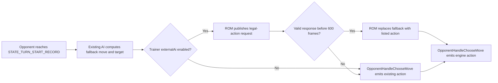

# Phase 0 Flow Review: Discovery and Contract Baseline

**Specification reviewed:** [`../specs/2026-07-18-phase-0-discovery-and-contract-baseline.md`](../specs/2026-07-18-phase-0-discovery-and-contract-baseline.md)

## Codebase grounding

- `src/battle_main.c` computes the AI decision at `STATE_TURN_START_RECORD` and stores the returned value in `gBattleStruct->aiMoveOrAction[battler]` before action selection.
- `src/battle_ai_main.c` calls `CheckMoveLimitations` while preparing AI data and writes the chosen target to `gBattleStruct->aiChosenTarget`.
- `src/battle_controller_opponent.c` consumes those fields in `OpponentHandleChooseMove`; `AI_TrySwitchOrUseItem` instead runs under the earlier `CONTROLLER_CHOOSEACTION` handler.
- `include/data.h` shows `struct Trainer` has only `aiFlags`, party data, display fields, `doubleBattle`, and seven currently unused padding bits. An independent `externalAi` bit can therefore preserve the trainer's existing AI flags and structure size.
- `test/battle/ai.c` and `include/test/battle.h` provide the existing AI battle-test vocabulary, including `AI_SINGLE_BATTLE_TEST`, `AI_FLAGS`, `EXPECT_MOVE`, `EXPECT_MOVES`, and explicit move targets.

## User flows

1. **Ordinary trainer battle.** The entry point is an AI-controlled trainer battler at turn setup. The normal AI computes `aiMoveOrAction` and `aiChosenTarget`; no external data is read. The terminal state is an emitted move, switch, item, or other ordinary AI action.
2. **External-enabled trainer, valid move response.** The entry point is the same turn setup for a trainer with `externalAi`. The ROM retains its ordinary move/target as fallback, publishes a sequence-numbered request, and accepts only a response selecting a current legal-action entry. The terminal state is the normal controller-emitted move.
3. **External-enabled trainer, no usable response.** The bridge may be absent, disconnected, incompatible, late, stale, malformed, duplicated, or illegal. The asynchronous wait state expires after 600 frames and emits the retained ordinary AI result. The battle never enters a busy wait.
4. **External-enabled trainer whose ordinary action is switching or an item.** `AI_TrySwitchOrUseItem` runs before move selection. The moves-only external phase does not intercept it, so its existing action is emitted unchanged. The terminal state is the existing switch/item behavior.
5. **Non-trainer, Palace, recorded, and double battles.** The first contract is not entered for those battle types. Their existing decision paths remain terminal states until a later phase has a dedicated specification.

## Gaps

### Critical

No critical gaps remain after the specification amendments. The two initially blocking ambiguities were resolved as follows:

- **Trainer opt-in storage:** use `struct Trainer.externalAi`, not an `aiFlags` bit. This prevents collision with existing trainer strategy flags.
- **Model-latency handling:** use a 600-frame asynchronous battle wait state, not a blocking Lua socket call or a busy loop. This preserves emulator frame processing while providing a deterministic fallback deadline.

### Important

1. **Legal-action authority needs a single ROM producer.** `ChooseMoveStruct` carries move/PP display data, while `CheckMoveLimitations` records whether each move is currently usable. If the service independently infers legality, Disable, Encore, PP, forced moves, or target state can diverge from the engine.

   **Resolution:** the protocol requires ROM-produced legal-action entries built from battle state, `CheckMoveLimitations`, and target helpers. The service selects only an entry index.

2. **The Lua bridge needs a reliable mailbox address for the exact ROM build.** A hard-coded EWRAM address would break after unrelated link-layout changes.

   **Resolution:** use a named `EWRAM_DATA` global and resolve its address from the ROM's matching map file. The mailbox begins with a magic value and protocol version; a mismatch disables external control and leaves ordinary AI active.

3. **A moves-only phase must not accidentally disable switching/item AI.** The existing controller invokes `AI_TrySwitchOrUseItem` on a different controller command than move choice.

   **Resolution:** Phase 1 explicitly leaves `CONTROLLER_CHOOSEACTION` untouched. Its tests prove that external-enabled trainers retain existing switch/item behavior until the dedicated extension phase.

4. **Move target semantics must include self-targeting and selected targets.** A single battle still contains self-target, enemy-target, and special move target categories.

   **Resolution:** every legal-action entry includes both move slot and resolved target battler; Phase 2 tests self, opponent, unusable move, and absent/fainted target cases.

### Minor

1. **The first external trainer needs a stable demo identity.** The repository's trainer data is in `src/data/trainers.h`, but the user has not selected a trainer ID.

   **Default:** Phase 1 adds the opt-in bit to a purpose-built test/demo trainer introduced by that phase; it does not modify an existing story trainer.

2. **The 600-frame wait needs player-facing copy.** The initial ROM-only mock has no need to display a wait message.

   **Default:** Phase 1 implements the state transition without UI. Phase 3's bridge specification adds a concise battle message only when a real asynchronous request is pending.

## Questions and settled defaults

1. **How does the service select a move without being able to submit raw values?** It returns `legalActionIndex`; the ROM maps it to the already-produced move-slot/target pair. This prevents untrusted service input from escaping the engine's legal set.
2. **What happens if a mailbox response belongs to the preceding turn?** The ROM rejects it because `responseSequence != requestSequence`, clears the response state for the new request, and retains its fallback.
3. **What happens if a script built for another ROM is loaded?** The mailbox magic/version check fails before any response is used; the script logs the mismatch and the ROM's fallback remains active.
4. **What happens if the external service wants to switch?** It cannot in versions 1–2 of the protocol. The existing ROM AI may still switch; service-selected switching requires the dedicated Phase 7 specification.
5. **What happens if a service response arrives after fallback?** The next request has a new sequence number, so the late response is stale and ignored.

## Recommended next steps

1. Create the four Phase 0 reference documents listed in the specification, using the evidence above.
2. In `protocol.md`, define the mailbox state machine and the exact validation order before defining field widths in the next code phase.
3. In the Phase 1 specification, use `Trainer.externalAi`, retain the precomputed AI action as fallback, and add tests for ordinary trainers, opt-in trainers, valid mock selection, illegal selection, and switch/item preservation.
4. Do not add an mGBA script or a Python service until the moves-only ROM hook and legal-action list are tested.
