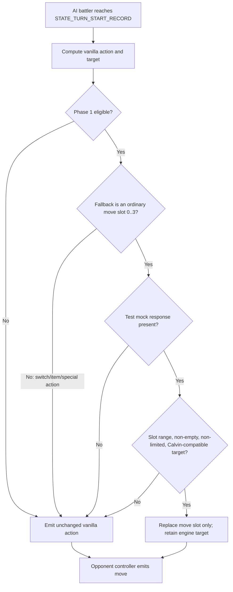

# Phase 1 Flow Review: Trainer Opt-In and ROM Mock

**Specification reviewed:** [`../specs/2026-07-18-phase-1-trainer-opt-in-and-rom-mock.md`](../specs/2026-07-18-phase-1-trainer-opt-in-and-rom-mock.md)

## Codebase grounding

- `struct Trainer` in `include/data.h` has `doubleBattle:1` followed by seven unused bits, so an `externalAi:1` field can retain the byte layout and does not need an `aiFlags` bit.
- `TRAINER_CALVIN_1` is declared in `src/data/trainers.h`, is started by `Route102_EventScript_Calvin` in `data/maps/Route102/scripts.inc`, and owns one level-6 Lillipup. Its learned `Leer`, `Tackle`, and `Odor Sleuth` moves target the opposing battler.
- `STATE_TURN_START_RECORD` in `src/battle_main.c` stores `ComputeBattleAiScores(battler)` in `gBattleStruct->aiMoveOrAction[battler]`; the same computation writes `gBattleStruct->aiChosenTarget[battler]`.
- `include/battle_ai_main.h` defines ordinary move choices as slots `0` through `3`; `AI_CHOICE_FLEE`, `AI_CHOICE_WATCH`, and `AI_CHOICE_SWITCH` are distinct non-move values.
- `AI_TrySwitchOrUseItem` is reached from the opponent controller's action-selection path, before `OpponentHandleChooseMove`; it must not be intercepted by a moves-only hook.
- `AI_SINGLE_BATTLE_TEST` builds synthetic opponent parties and starts with `TRAINER_LEAF` as its recorded opponent ID. The runner can add a small directive that changes that recorded ID before battle initialization, allowing tests to exercise the real immutable Calvin and Billy trainer data without casting away `const`.

## User flows

1. **Calvin production-ROM battle.** Route 102 starts `TRAINER_CALVIN_1`. He is opted in, but production code has no mock response, so the precomputed vanilla move and target are emitted. The battle completes normally.
2. **Eligible test mock.** A synthetic single AI battle selects `TRAINER_CALVIN_1` in its recorded battle and submits a legal opponent-targeting move slot. The hook replaces only the move slot; the precomputed engine target remains valid. The visible move proves the seam works.
3. **Absent or invalid mock.** The mock is absent, out of range, empty, limited by the engine, or target-incompatible. The hook rejects it and leaves both fallback values unchanged.
4. **Non-opted-in or unsupported battle.** A normal trainer, double, multi, special facility, recorded, Palace, link, or wild battle skips the hook and follows the existing path.
5. **Vanilla switch/item path.** The ordinary controller can choose a switch/item or `AI_CHOICE_SWITCH`; the Phase 1 hook never replaces a non-move fallback, so the existing behavior remains authoritative.

## Gaps

### Critical

1. **The initial specification permitted a mock move to replace a fallback switch or special action.** `ComputeBattleAiScores` can return `AI_CHOICE_SWITCH` rather than a move slot. Replacing that value would violate the stated moves-only boundary and can interfere with the separate `AI_TrySwitchOrUseItem` path.

   **Resolution:** attempt a mock only when the precomputed fallback is an ordinary move slot `0..3`; otherwise retain the fallback unconditionally.

2. **Keeping the vanilla target is safe only for an explicitly bounded move set.** The initial text allowed any current legal slot but did not prove that the fallback target was compatible with that move. This would be unsafe for self-target or unusual target categories.

   **Resolution:** Phase 1 accepts mock slots only for Calvin-compatible opponent-targeting moves and test fixtures containing those same opponent-targeting moves. A general move-slot/target action list is deferred to Phase 2.

### Important

1. **The test runner starts AI battles as `TRAINER_LEAF`.** `AI_SINGLE_BATTLE_TEST` configures synthetic Pokémon and AI flags, so it would otherwise never reach Calvin's real data flag.

   **Resolution:** add a `TRAINER_OPPONENT(trainerId)` test directive that changes only `DATA.recordedBattle.opponentA` while the test is being configured. It is valid only in AI single-battle tests and uses production `gTrainers` data after normal battle initialization. No production eligibility override is needed.

2. **The special-battle exclusion list must be code-expressible.** “Other special battle” would invite inconsistent future conditions.

   **Resolution:** derive a single `IsExternalAiEligibleBattler` predicate that requires `BATTLE_TYPE_TRAINER` and rejects the concrete flags listed in the specification: `BATTLE_TYPE_DOUBLE`, `BATTLE_TYPE_MULTI`, `BATTLE_TYPE_LINK`, `BATTLE_TYPE_RECORDED`, `BATTLE_TYPE_SAFARI`, `BATTLE_TYPE_PALACE`, `BATTLE_TYPE_FRONTIER`, `BATTLE_TYPE_EREADER_TRAINER`, `BATTLE_TYPE_TRAINER_HILL`, `BATTLE_TYPE_SECRET_BASE`, and `BATTLE_TYPE_TWO_OPPONENTS`. The implementation plan must verify their actual constant names.

3. **`CheckMoveLimitations` must be read at the decision seam, not inferred from AI scores.** A nonzero AI score is not a legal-action contract.

   **Resolution:** recompute `CheckMoveLimitations(battler, 0, MOVE_LIMITATIONS_ALL)` immediately before accepting the mock, then reject a bit set for the requested slot. The test disables the selected move through existing battle-test facilities and asserts fallback.

### Minor

1. **Calvin's rematches are separate IDs.** The user selected the first Route 102 encounter, not all Calvin battles.

   **Resolution:** set only `TRAINER_CALVIN_1.externalAi = TRUE`; do not alter `TRAINER_CALVIN_2` through `TRAINER_CALVIN_5`.

2. **Build-helper compatibility fixes are present in the working tree.** `tools/mapjson/json11.cpp` and `src/secret_base.c` contain prior local build fixes unrelated to Phase 1.

   **Resolution:** do not bundle or revert them in Phase 1. The plan's verification records their presence and limits Phase 1 source edits to the listed files.

## Questions and settled defaults

1. **When an opted-in trainer has no bridge yet, what happens?** The production ROM reports no mock response and emits the precomputed vanilla fallback. This is safe because no external state is required.
2. **Can any trainer use the field later?** Yes. The data field and production predicate are generic; Phase 1 enables only `TRAINER_CALVIN_1` to keep acceptance testing controlled.
3. **Can a test response choose a target?** No. It supplies a move slot only for opponent-targeting fixtures. Phase 2 owns the first action format with explicit target validation.
4. **Does Phase 1 change switching or items?** No. A non-move fallback skips mock handling and the existing controller path continues unchanged.

## Recommended next steps

1. Amend the Phase 1 specification with the two critical resolutions and the precise test-only override boundary.
2. Recheck the amended specification for the generic field, Calvin-only data change, slot-only temporary contract, and no-response fallback.
3. After the user approves the reviewed specification, write the task-level implementation plan in `docs/openai-battle-agent/plans/`.
