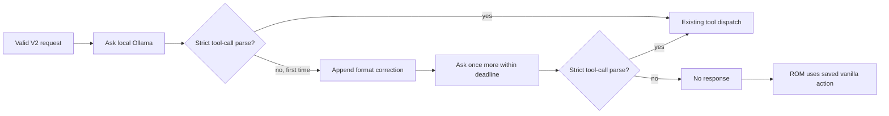

# Phase 4A Flow Review: Bounded Local-Model Format Retry

**Specification reviewed:** [Phase 4A model-format retry](../specs/2026-07-29-phase-4a-model-format-retry.md)  
**Review date:** 2026-07-29  
**Method:** `spec-flow-analyzer`, grounded in `tools/mgba-bridge/battle_agent_service.py`, `tools/mgba-bridge/bridge_protocol.py`, `tools/mgba-bridge/mgba_bridge.lua`, and a live mGBA/Ollama capture.

## Repository context

- `extract_tool_call` currently accepts one native Ollama function call or one complete JSON-content object with exactly `name` and `arguments`; it correctly rejects malformed pseudo-JSON.
- `run_tool_agent` returns `None` immediately when that parser returns `None`. `handle_request_frame` logs `produced no response`, and the ROM retains its saved vanilla choice.
- Live capture after transport repair proved a 425-byte request parses, but qwen sometimes returned `{"name": get_battle_state, "arguments": {}}`; no Ollama tool was dispatched. This is a local-model formatting failure, not a ROM/Lua frame or action-authority failure.
- The service already caps its loop at `MAX_TOOL_CALLS = 12` and its total work at a 12-second monotonic deadline. The Lua bridge and ROM independently enforce fixed frames, legal-action indices, and a 900-frame vanilla fallback.

## User flows

### 1. Valid tool call on the first reply

The service decodes the V2 frame, receives a strictly valid native or exact JSON-content tool call, dispatches the existing read-only handler, and eventually accepts exactly one legal `choose_action`. This flow remains unchanged.

### 2. One malformed first reply, then correction

The malformed reply is never repaired or executed. The fresh reply still must pass the existing tool allowlist, arguments, and legal `choose_action` checks.

### 3. Invalid command after a valid format

The existing dispatch rejects unknown tools, invalid arguments, repeated terminal choices, and unlisted action indices without a retry. The ROM fallback handles the absent response.

### 4. Endpoint/deadline failure

An Ollama `OSError`, HTTP failure, or expired monotonic deadline ends the service run without a response. Retrying these failures could consume the ROM time budget and is not part of this sub-phase.

## Gaps

### Critical

None. ROM and Lua independently retain their fixed-wire and legal-action protections, so a retry cannot grant model authority over moves or targets.

### Important

1. **The retry could accidentally become unbounded.** Repeated malformed replies would consume the 15-second gameplay budget. **Resolution:** the specification requires only one retry, within the existing 12-call loop and 12-second monotonic deadline.
2. **A corrective parser could accidentally treat malformed pseudo-JSON as a command.** That would undermine the strict compatibility decision. **Resolution:** the retry asks for a new reply; it does not modify `extract_tool_call` or inspect the malformed text beyond its existing rejection.
3. **A retry could mask genuine model/service failures.** **Resolution:** HTTP/timeout errors, invalid arguments, unknown tools, and repeated terminal choices remain immediate no-response paths; only parser failure receives one retry.

### Minor

1. **Operators need to distinguish malformed output from a disconnected service.** Safe default: retain concise local diagnostics indicating the format retry and final no-response result, without logging or persisting full battle payloads.

## Questions and resolved defaults

1. **Should the model be forced to use a particular inspection order after a malformed reply?** No. The user requested the full tool list and model discretion; the correction only restates the valid call shape and terminal constraint.
2. **Should a malformed reply count as a tool call?** It consumes one bounded model-loop iteration but is not a dispatched tool call; this keeps total model work bounded at 12 and avoids increasing the 12-second deadline.
3. **Should the bridge or ROM retry a rejected model command?** No. Their current no-response/fallback behavior stays unchanged and is the safest mechanics boundary.

## Recommended next steps

1. Add a failing test for one malformed reply followed by valid tool calls, and tests for repeated malformed output and deadline exhaustion.
2. Add one `format_retry_used` branch in `run_tool_agent`; append only a constant correction message, then reuse the unchanged strict parser and dispatcher.
3. Run the full Python bridge/service suite, reload exactly one Lua script instance, restart the service, and verify a real response in mGBA before claiming Phase 4A connected success.
