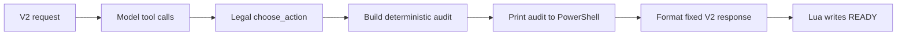

# Phase 4B Flow Review: PowerShell Decision Audit

**Specification reviewed:** [Phase 4B PowerShell decision audit](../specs/2026-07-29-phase-4b-powershell-decision-audit.md)  
**Review date:** 2026-07-29  
**Method:** `spec-flow-analyzer`, grounded in `tools/mgba-bridge/battle_agent_service.py`, `tools/mgba-bridge/tests/test_battle_agent_service.py`, `tools/mgba-bridge/bridge_protocol.py`, and the Phase 4A mGBA evidence.

## Repository context

- `run_tool_agent` currently returns only `int | None`, so it discards the ordered read-only tool history that the audit requires.
- `handle_request_frame` owns the decoded `FrameRequest`, the final 13-byte response formatting, and the current `produced no response` diagnostic. It is the safe seam to emit a complete audit before any response leaves Python.
- `analyze_action`, `get_battler_moves`, `compare_speed`, `list_legal_actions`, and `_label` already derive all required facts solely from the decoded V2 payload, legal action list, and checked-in catalog.
- Existing tests patch `request_ollama` and assert `run_tool_agent` returns a selected integer. The audit refactor must preserve strict parser, tool dispatch, malformed retry, and no-response behavior while updating those expectations intentionally.

## User flows

### 1. Valid model selection

The audit lists only tools actually dispatched, current legal options, the selected option, and deterministic ROM facts. It does not alter the decision or emit data to Lua/ROM.

### 2. Malformed first reply then a valid selection

The existing correction retry remains a separate service diagnostic. The audit excludes that rejected model message and contains only later successfully dispatched tools, then follows the valid-selection flow.

### 3. No legal model decision

A second malformed reply, invalid command, service error, or deadline returns no decision. `handle_request_frame` prints the one-line `vanilla_fallback` audit and sends no V2 response; the ROM's existing 900-frame path owns the fallback move.

### 4. Audit construction failure

If a catalog/action/payload formatting invariant fails while building an audit, `handle_request_frame` must not send a response. It logs a concise rejection and lets the existing ROM fallback handle the turn.

## Gaps

### Critical

None. The audit remains outside the ROM/Lua authority boundary and does not add a new legal-action family.

### Important

1. **Tool history has no current owner after the model loop returns.** Without an explicit return type, the audit could guess from raw messages or log all available tools. **Resolution:** return a small immutable service-owned decision record containing `action_index` and the ordered tuple of successfully dispatched tool names.
2. **Audit output could be emitted after the bridge response.** If output formatting fails then, the action may already be committed despite the specified failure behavior. **Resolution:** build and log the audit before `format_response_frame`; a formatting exception returns no response.
3. **“Effectiveness” needs a stable readable label.** Numeric enum values are not useful to the operator, but Python must not recalculate damage. **Resolution:** one local mapping of the existing four ROM categories to `immune`, `not-very-effective`, `neutral`, and `super-effective`; an unexpected category raises `ToolError`.

### Minor

1. **Repeated tool calls can make the audit long.** Safe default: retain call order and repetition, as the 12-call cap bounds the line.
2. **Speed context is relevant even when the model did not call `compare_speed`.** Safe default: label it `ROM speed context`, not as a model observation.

## Questions and resolved defaults

1. **Should an audit include raw model content?** No. The audit never prints raw model replies, inferred rationale, or full payloads.
2. **Should no-decision outcomes emit all legal-action details?** No. The one-line fallback audit is enough and avoids suggesting the model evaluated those options.
3. **Does the audit justify trainer switching?** No. The audit observes only current move actions; switching stays a separate legal-action and mailbox-contract phase.

## Recommended next steps

1. Add a failing service test for a returned decision record and exact successful/no-decision audit messages.
2. Introduce the smallest immutable decision record, collect tool names only after dispatch passes validation, and centralize audit formatting in a pure helper.
3. Update `handle_request_frame` to emit an audit before formatting the bridge response, then run the full Python suite and manual Calvin smoke test.
